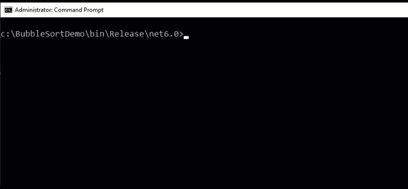

# Bubble Sort Demo

A simple console application that demonstrates bubble sort algorithm.

## Why do I made this project?

I've started to learn C# course in #CS_INTERNSHIP program. In this course, I've to write a program which has a method for sorting numbers with the bubble sort algorithm.

But I've decided to make it even more amazing, so I created this project to do a demonstration in addition to sorting.

## Features:

- Sorting a list of `int` numbers with Bubble Sort algorithm.
- Demonstrating the sort progress
- Since I'm in the early steps of the C# course, I tried to build the project with simple C#  elements.

## How it works + Legends
- This demo moves along the `List` cells and demonstrates the bubble sort.
- A darker blue number indicates a smaller number and a lighter blue number indicates a larger number in a pair of numbers to be compared
- horizontal red marker indicates two numbers to be compared
- vertical red marker indicates the last number to be compared

## How to install and use?
- Download tha whole project. It's a rugular C# applicatino source code. `.\BubbleSortDemo` contains source code, project file and solutin file.
- There is a UnitTest in `.\UnitTest_BubbleSort` folder to test the bubble sort method. 

## Screenshot

